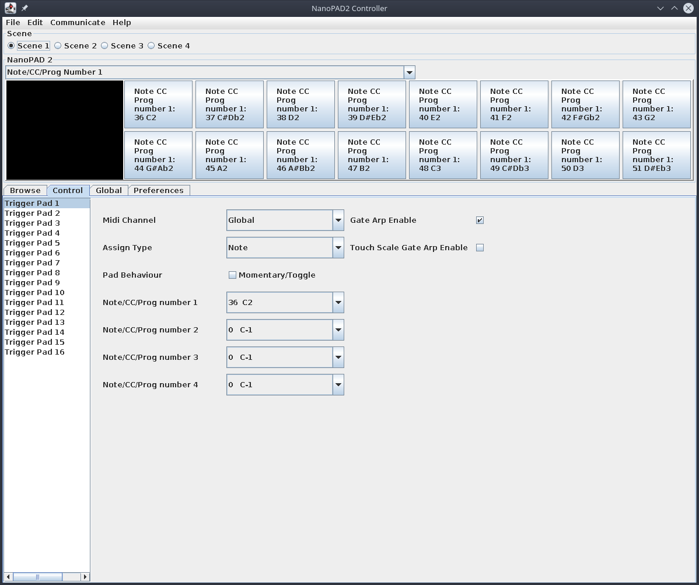

# Nano PAD 2 Controller Editor for Linux



## Build Instructions
### Java Maven Build
Whilst in the project directory run the following:

```bash
mvn assembly:assembly -DdescriptorId=jar-with-dependencies
```

### C++ Java JNI Dynamic Library Build

#### Dependencies
A Java JDK must be installed and the JAVA_HOME environment variable set.
The ALSA development libraries must be installed.

#### Building
Whilst in the project directory run the following (the maven assembly command above must be run first):

```bash
./jni_library/build_jni.sh
```

## Run Instructions

Whilst in the project directory run the following:

```bash
java -Djava.library.path=./target/ -jar ./target/NanoPAD2Controller2-1.0-SNAPSHOT-jar-with-dependencies.jar
```

## Installation

Run the following changing the value of NANO_PAD_INSTALL_DIR:

```bash
export NANO_PAD_INSTALL_DIR=/home/kevin/NanoPAD2Controller
mkdir -p $NANO_PAD_INSTALL_DIR
cp -p ./target/NanoPAD2Controller2-1.0-SNAPSHOT-jar-with-dependencies.jar ./target/libnativemidisystem.so ./install/nano_pad_controller.sh $NANO_PAD_INSTALL_DIR
```
